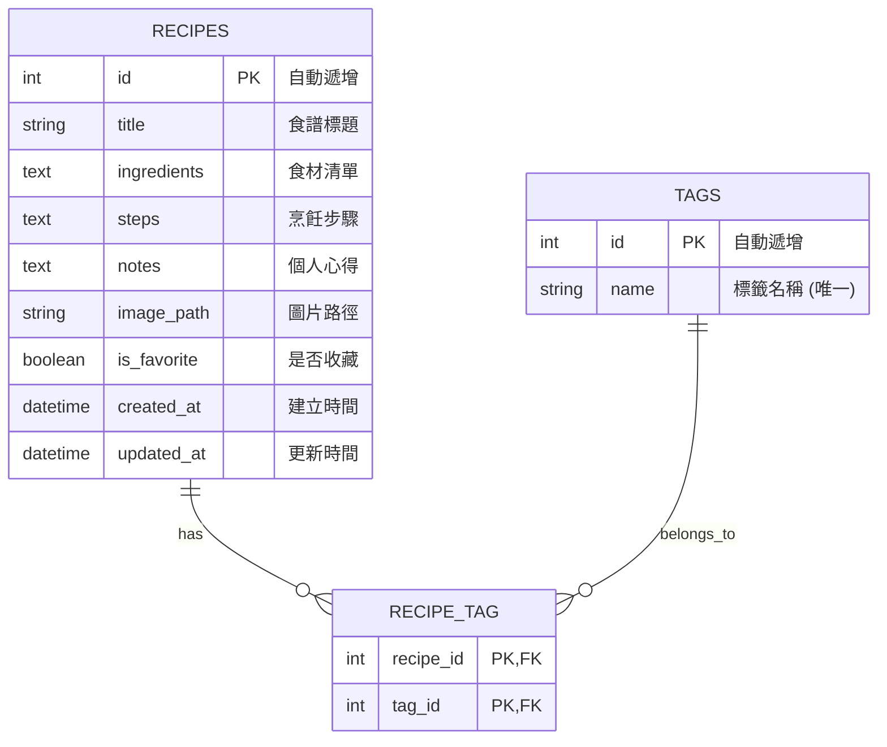

# 資料庫設計文件 (DB DESIGN) - 食譜收藏夾

本文件基於系統流程與架構，定義「食譜收藏夾」的 SQLite 資料庫設計。

## 1. ER 圖（實體關係圖）

## 2. 資料表詳細說明

### recipes (食譜資料表)
存放每一篇食譜的主要內容。

| 欄位名稱 | 型別 | 必填 | 預設值 | 說明 |
| :--- | :--- | :--- | :--- | :--- |
| `id` | INTEGER | 是 | (Auto Increment) | Primary Key |
| `title` | VARCHAR(100) | 是 | - | 食譜標題 |
| `ingredients` | TEXT | 否 | - | 食材清單 |
| `steps` | TEXT | 否 | - | 烹飪步驟 |
| `notes` | TEXT | 否 | - | 個人心得與註記 |
| `image_path` | VARCHAR(255) | 否 | - | 上傳圖片在本地檔案系統的路徑 |
| `is_favorite` | BOOLEAN | 是 | 0 (False) | 是否加入最愛 |
| `created_at` | DATETIME | 是 | CURRENT_TIMESTAMP | 建立時間 |
| `updated_at` | DATETIME | 是 | CURRENT_TIMESTAMP | 更新時間 |

### tags (標籤資料表)
存放所有的自訂標籤名稱，供分類使用。

| 欄位名稱 | 型別 | 必填 | 預設值 | 說明 |
| :--- | :--- | :--- | :--- | :--- |
| `id` | INTEGER | 是 | (Auto Increment) | Primary Key |
| `name` | VARCHAR(50) | 是 | - | 標籤名稱，需為唯一值 (Unique) |

### recipe_tag (食譜標籤關聯表)
記錄食譜與標籤的多對多 (Many-to-Many) 關聯。

| 欄位名稱 | 型別 | 必填 | 預設值 | 說明 |
| :--- | :--- | :--- | :--- | :--- |
| `recipe_id` | INTEGER | 是 | - | Foreign Key 關聯 `recipes.id` |
| `tag_id` | INTEGER | 是 | - | Foreign Key 關聯 `tags.id` |

> 註：`recipe_id` 與 `tag_id` 共同組成 Composite Primary Key。

## 3. SQL 建表語法

完整的建表語法請參考 `database/schema.sql` 檔案。

## 4. Python Model 程式碼

根據架構文件，本專案採用 SQLAlchemy 來定義 Python Model。
包含 `Recipe` 與 `Tag` 的定義，以及 CRUD 方法的實作，請參考 `app/models/recipe.py` 與 `app/models/__init__.py`。
