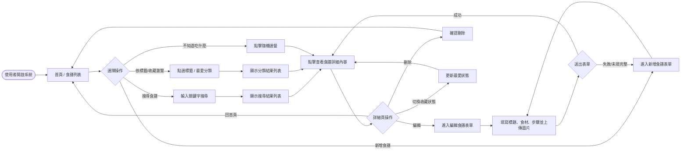
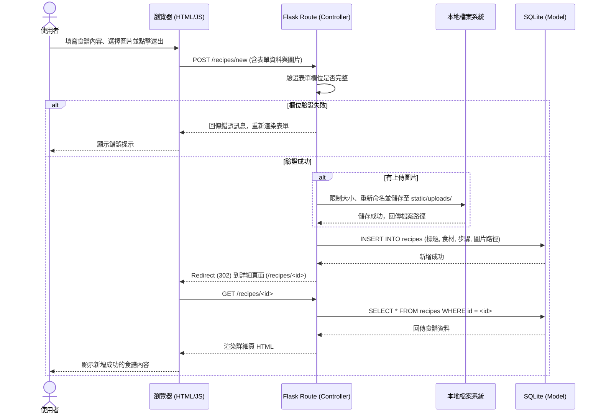

# 流程圖文件 (FLOWCHART) - 食譜收藏夾

本文件基於 PRD 與系統架構，呈現「食譜收藏夾」的使用者流程、系統序列圖與功能清單對照表。

## 1. 使用者流程圖（User Flow）

此流程圖描述使用者進入系統後，可以進行的各項主要操作路徑。

## 2. 系統序列圖（Sequence Diagram）

此序列圖描述「新增食譜並上傳圖片」的核心系統互動流程。

## 3. 功能清單對照表

以下為 MVP 階段主要功能的 URL 路徑與 HTTP 方法規劃：

| 功能名稱 | 對應 URL 路徑 | HTTP 方法 | 說明 |
| :--- | :--- | :--- | :--- |
| **首頁 / 所有食譜** | `/` 或 `/recipes` | `GET` | 顯示食譜列表，支援分頁 |
| **關鍵字搜尋** | `/recipes/search` | `GET` | 透過 `?q=關鍵字` 進行搜尋 |
| **隨機選餐** | `/recipes/random` | `GET` | 從資料庫隨機抽取一筆並導向詳細頁 |
| **新增食譜 (表單)** | `/recipes/new` | `GET` | 渲染新增食譜的 HTML 表單 |
| **新增食譜 (送出)** | `/recipes/new` | `POST` | 接收表單與圖片，處理並存入資料庫 |
| **食譜詳細內容** | `/recipes/<int:id>` | `GET` | 顯示單一食譜的詳細資訊與圖片 |
| **編輯食譜 (表單)** | `/recipes/<int:id>/edit` | `GET` | 渲染包含既有資料的編輯表單 |
| **編輯食譜 (送出)** | `/recipes/<int:id>/edit` | `POST` | 更新食譜資料 (可換圖片) |
| **刪除食譜** | `/recipes/<int:id>/delete` | `POST` | 刪除該食譜 (與關聯圖片) |
| **標籤過濾** | `/tags/<int:tag_id>` | `GET` | 顯示特定標籤底下的食譜 |
| **切換收藏狀態** | `/recipes/<int:id>/favorite` | `POST` | 將食譜加入/移除最愛清單 |

> 註：由於 HTML 表單原生不支援 `PUT` / `DELETE`，因此表單送出（如更新、刪除）皆統一使用 `POST` 方法，並可視需求在路徑加上 `/edit` 或 `/delete` 標識。
